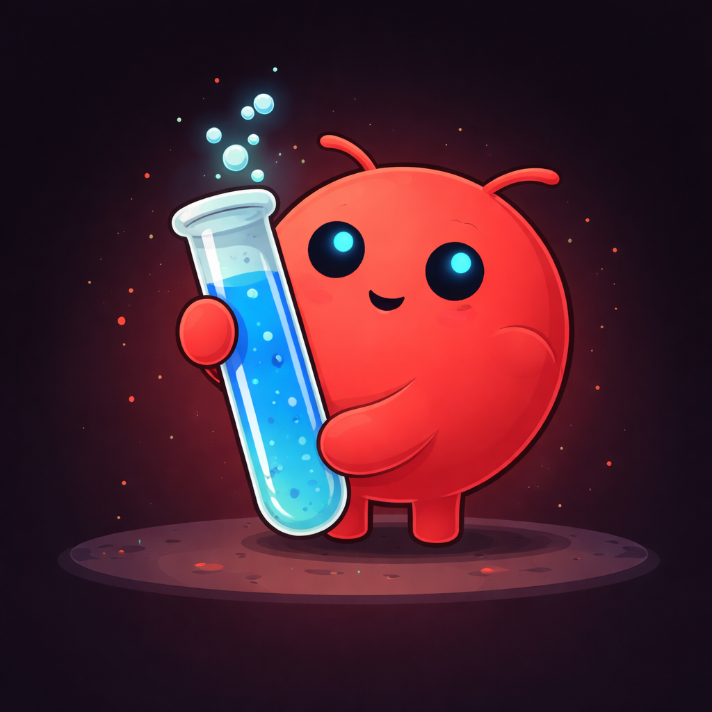

# Crabe 🦀

<p align="center">
  
</p>

<p align="center">
  <a href="https://github.com/Gabrielfernandes7/crabe/actions">
    
  </a>
  <a href="https://github.com/Gabrielfernandes7/crabe/releases">
    
  </a>
  
  
</p>

**CLI moderna em Golang** para rodar **OpenClaw + Ollama + Docker** 100% local.

**Objetivo principal:**  
Entre em **qualquer pasta** do seu computador e rode `crabe init`.  
Pronto. Você terá um agente inteligente trabalhando exatamente no contexto daquele projeto.

---

### Demo

  
*(GIF demonstrando `crabe doctor` e `crabe init` em ação – substitua pelo GIF real quando gravar)*

---

## Como instalar (uma única vez)

### Recomendado (com Makefile)

```bash
git clone https://github.com/Gabrielfernandes7/crabe.git
cd crabe
make install
```

Isso compila o binário Go e instala o comando `crabe`.

### Manual

```bash
cd crabe
go build -o crabe ./cmd/crabe
cp crabe ~/.local/bin/
chmod +x ~/.local/bin/crabe
```

---

## Como usar (Fluxo diário)

```bash
# 1. Entre na pasta do projeto
cd ~/Documentos/meu-projeto

# 2. Inicialize o agente
crabe init
```

Depois disso, converse com o agente usando linguagem natural dentro do contexto da pasta.

---

## Comandos principais

| Comando                | Descrição                                              |
|------------------------|--------------------------------------------------------|
| `crabe init`           | Inicializa o agente no projeto atual                   |
| `crabe init --force`   | Força reinicialização                                  |
| `crabe doctor`         | Diagnóstico completo do sistema                        |
| `crabe status`         | Status dos serviços e modelo atual                     |
| `crabe --help`         | Lista todos os comandos e opções                       |

---

## Modelos recomendados

- **`qwen2.5-coder:7b`** → **Melhor equilíbrio** (recomendado)
- **`qwen2.5-coder:14b`** → Mais capaz (mais RAM)
- **`glm-4.7-flash`** → Rápido para testes

---

## Desenvolvimento

```bash
make build          # Compila o binário
make install        # Compila e instala
make doctor         # Executa crabe doctor
make init           # Executa crabe init
make clean          # Limpa binários
```

---

## Tecnologias

- **Go** + **Cobra** (estrutura de comandos)
- **Lipgloss** (interface bonita no terminal)
- OpenClaw + Ollama + Docker

---

## Dicas e Troubleshooting

- Rode `make install` sempre que alterar o código Go.
- Problema com comando não encontrado? → `make remove-old && make install`
- Erros no Docker? → Verifique se seu usuário está no grupo `docker`.

---

**Pronto!**  
Agora é só entrar em qualquer pasta e digitar:

```bash
crabe init
```

---

## Bibliotecas principais

- [spf13/cobra](https://github.com/spf13/cobra)
- [charmbracelet/lipgloss](https://github.com/charmbracelet/lipgloss)

---

### Próximos passos sugeridos para você:

1. **Grave um GIF curto** (5–10 segundos) mostrando:
   - `make install`
   - `crabe doctor`
   - `crabe init`
   - Saída colorida no terminal

   Ferramentas fáceis: **Terminalizer**, **asciinema + asciinema2gif**, ou simplesmente gravar a tela com Kap (macOS) / Peek (Linux).

2. Suba o GIF para https://imgur.com ou para a pasta `docs/` e substitua o link `https://i.imgur.com/XXXXXXX.gif`.

Quer que eu ajuste algo (mais badges, deixar mais curto, adicionar seção de roadmap, ou badges de GitHub Actions)?  
Ou prefere que eu gere um `.goreleaser.yml` básico para facilitar releases automáticas no futuro?  

Me diga como quer continuar! 🦀